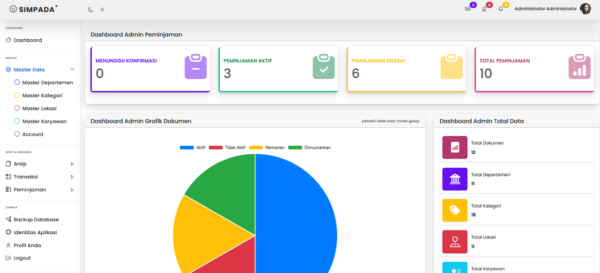
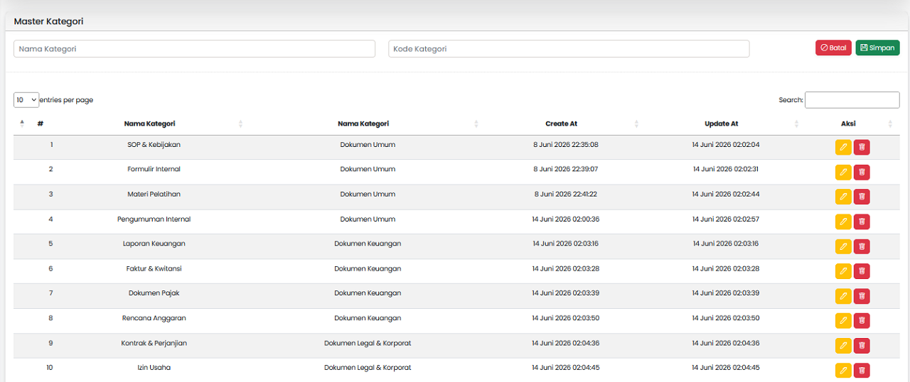
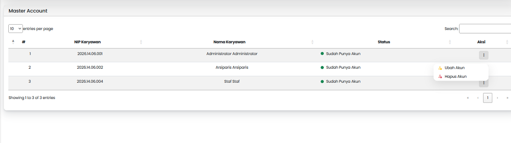
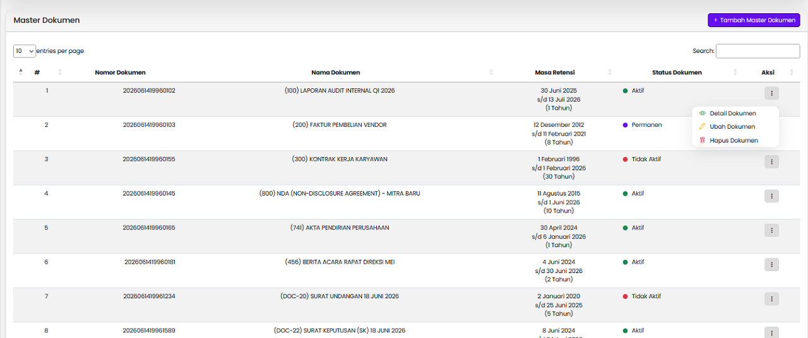
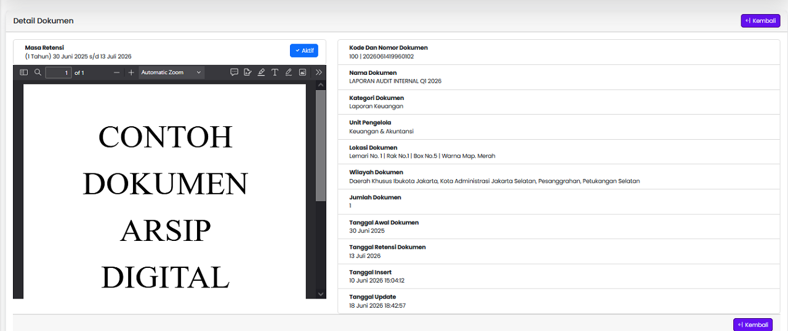
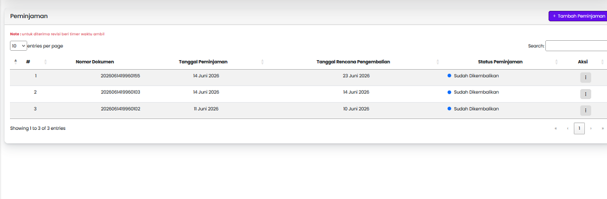
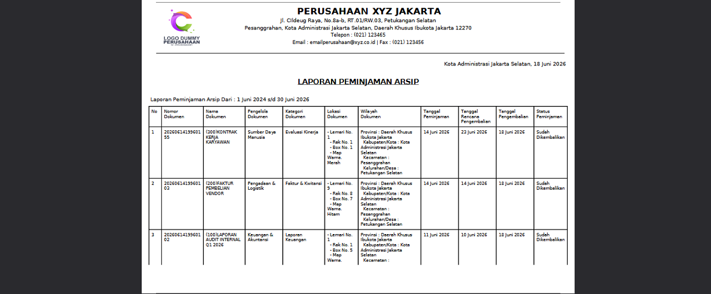
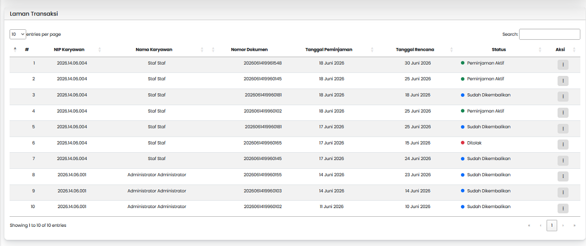
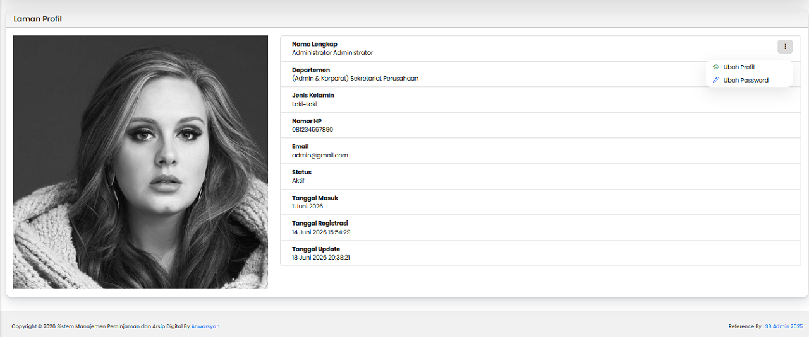

# SIMPADA (Sistem Manajemen Peminjaman dan Arsip Digital)


## Ringkasan
SIMPADA merupakan aplikasi manajemen arsip dan peminjaman dokumen digital yang mendukung pengelolaan arsip aktif maupun tidak aktif, peminjaman dokumen antar departemen, laporan arsip, laporan transaksi, serta pengelolaan user berdasarkan hak akses.
Role yang tersedia:
- Admin
- Arsiparis
- Staff

## Status Project
🚧 Project ini dibuat untuk tujuan pembelajaran dan pengembangan kemampuan pemrograman PHP dengan arsitektur MVC. Pengembangan fitur masih dapat dilakukan di masa mendatang.

## Teknologi yang digunakan (Built With)
1. PHP 7 ke atas ;
2. MySQLi (PDO) ;
3. Bootstrap ;
4. Bootstrap Icon ;
5. Chart JS ;
6. DataTable ;
7. JQuery ;
8. SB-Admin ;
9. SeetAlert ;
10. Serta Teknologi tambahan lainnya

## Struktur Folder Project
```text
simpada/
├── app/
│   ├── auth/
│   ├── config/
│   ├── controllers/
│   ├── global/
│   ├── helpers/
│   ├── libraries/
│   ├── models/
│   ├── requests/
│   ├── services/
│   ├── views/
│   └── init.php
│
├── assets/
│   ├── mystyle/
│   └── vendor/
│
├── public/
│   ├── img/
│   ├── database/
│   └── media/
│
├── .htaccess
└── index.php
```

## Prasyarat menjalankan aplikasi (Prerequisites)
1. Pastikan XAMPP Versi terbaru ;
2. PHP Versi 7 Ke atas

## Instalasi (Installation & Setup)
1. Setelah berhasil mendownload file .zip dari github ;
2. Simpan project ke dalam direktori lokal, jika menggunakan XAMPP simpan di folder htdocs ;
3. Jalankan XAMPP, lalu masuk ke localhost/phpmyadmin dan buat database dengan nama: `simpada`;
3. Import database yang ada di: public/database/simpada.sql ;
4. Selanjutnya pada bagian script ubah file **.htaccess** pada baris: RewriteBase /simpada/;; `Sesuaikan dengan lokasi project.` ;
5. Ubah juga file **app/config/config.php** pada baris: define('BASEURL', 'http://simpada') ; `Sesuaikan dengan lokasi project.` ;

## Cara Penggunaan (Usage)
1. Setelah database, htaccess file config disesuaikan, silahkan jalanakan aplikasi di local browser;
2. bisa gunakan akun berikut untuk tester ;
3. silahkan explore fitur aplikasi ;

## Akun Demo
```text
Admin
Username : admin
Password : admin
Arsiparis
Username : arsiparis
Password : arsiparis
Staff
Username : staff
Password : staff
```

## Fitur
1. **Libraries** untuk stuktur routing aplikasi seperti pada folder libraries seperti : `(BaseController)`, `(BaseModel)`, `(Controller)`, `(Database)` , `(Routing)`, `(Validasi)` ;
2. **Models** Untuk logika dan proses database;
3. **Controlers** Untuk logika bisnis aplikasi ; 
4. **views** Untuk tampilan laman dan input data;
5. **auth** Untuk menampung Middleware dan security user dan role ;
6. **config** Untuk menampung konkeis database dan configurasi seperti SESSION, dan config untuk fungsi upload ;
7. **global** Untuk menampung data global yang akan digunakan di laman tertentu ;
8. **helpers** Untuk menampung fungsi upload dan fungsi tanggal ;
9. **requests** Untuk menampung data input sebelum dikirim ke models ;
10. **services** Untuk mengelola hasil datatabse dari models sebelum diambil oleh controllers ;
11. ada fitur login untuk beberapa role user seperti : Admin, Arsiparis, dan Staff ;
12. Kelola data Karyawan , Accounts Login Karyawan, Departemen, Kategori Dokumen, Lokasi Dokumen ;
13. Kelola data Arsip yang meliputi :
- Input, Ubah dan hapus dokumen ;
- status dokumen : Aktif, Tidak Aktif, Permanen dna Dimusnahkan ;
- masa retensi dokumen ;
- priview dokumen ;
- wilayah dokumen menggunakan wilayah indonesia ;
- laporan arsip 
- dan lainnya
14. Penimjaman dokumen yang meliputi :
- cari dokumen untuk dipinjam ;
- ketesediaan dokumen untuk dipinjam ;
- status pinjaman : Menunggu Konfirmasi, Diterima, Ditolak, Peminjaman Aktif, Peminjaman Selesai, Peminjaman Melewati batas Waktu ;
- invoice peminjaman ;
- laporan peminjaman ;
- dan lainnya
15. Kelola Transaksi yang meliputi :
- Kelola peminjaman staff ;
- Laporan Transaksi
16. Identitas aplikasi dan perusahaan, untuk kop surat pada laporan ;
17. Profil masing" user yang bnisa ubah data dan ubah password ;
18. Dan lainnya yang bisa di explore dalam aplikasi.

## Screenshot
### Laman Dashboard Admin dan Arsiparis

### Laman Dashboard Staff

### Laman Kelola Departemen

### Laman Kelola Kategori

### Laman Kelola Lokasi

### Laman Kelola Karyawan

### Laman Kelola Accounts

### Laman Kelola Arsip

### Laman Priview Arsip

### Laman Laporan Arsip

### Laman Cetak Laporan Arsip

### Laman Peminjaman 

### Laman Tambah Peminjaman 

### Laman Cetak Invoice Peminjaman 

### Laman Laporan Peminjaman 

### Laman Cetak Laporan Peminjaman 

### Laman Transaksi 

### Laman Laporan Transaksi 

### Laman Cetak Laporan Transaksi 

### Laman Identitas Aplikasi

### Laman Profil User


## Sumber Referensi
- Template refrensi dari : [SB-Admin 2](https://startbootstrap.com/theme/sb-admin-2)
- Foto laman profil menggunakan referensi dari: [codepen.io](https://codepen.io/atulcodex/pen/ZPgPQQ) 
- Logika PHP, Javascrip, HTML, CSS dari  dokumentasi resmi, Youtube, Artikel, Website dan lainnya
- Tutorial PHP, Javascrip, HTML, CSS dari Buku
- Serta hasil belajar dari berbagai sumber lainnya

## Tujuan
Repository ini dibuat untuk **pembelajaran serta pemahaman PHP** dan **latihan menggunakan GitHub**.
Semoga bisa bermanfaat bagi yang mau belajar 🙌
Semua data, foto, nomor yang tersedia di aplikasi bersifat dummy dan bukan data asli, seperti foto artis terkenal, nama karyawan, data-data karyawan, nomor dokumen dan lainnya digunakan untuk tujuan belajar

## Kontribusi (Contributing)
Masukan, saran, dan perbaikan sangat terbuka untuk membantu pengembangan project ini.
Jika menemukan bug atau kesalahan implementasi, silakan membuat Issue atau Pull Request.
Mari belajar dan berkembang bersama 🙌

## License
Proyek ini dirilis dengan lisensi **MIT**, dan dibuat khusus untuk tujuan pembelajaran.  
Boleh dipelajari, digunakan, dan dikembangkan lebih lanjut selama tetap mencantumkan kredit.  

Lihat file [LICENSE](LICENSE) untuk detail lengkap.

### Terima Kasih 🙌
